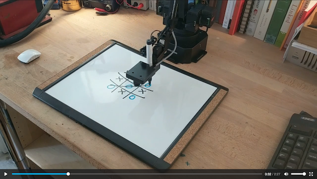

# uArm Projects

Demo projects made using the uArm Swift Pro, to have fun and explore the arm's functionality.

These are being developed as a part of a fellowship at NYU's ITP program, from February to May 2020.

##### Links

 - [uArm projects source code](https://github.com/andysigler/uarm-projects)
 - [uArm Python wrapper I developed for these projects](https://github.com/andysigler/uarm-python-wrapper)

## Projects

### Tic-Tac-Toe

The uArm uses it's camera to and a marker to play tic-tac-toe with me.

The project can be found found [at this link](https://github.com/andySigler/uarm-projects/tree/master/tictactoe)

See the video, click the image below:

[](https://andysigler.github.io/uarm-projects/tictactoe/tictactoe_video.mp4)

### Basketball

The uArm uses it's camera and suction tool to play a solo game of basketball.

The project can be found found [at this link](https://github.com/andySigler/uarm-projects/tree/master/basketball)

See the video, click the image below:

[](https://andysigler.github.io/uarm-projects/basketball/basketball_video.mp4)


## Installation

To run the projects in this repo, install this repository with git, and install the requirements:
```
git clone https://github.com/andySigler/uarm-projects.git
cd uarm-projects
pip install -r requirements.txt
```
To run an individual project, read it's accompanying README.md for instructions.
