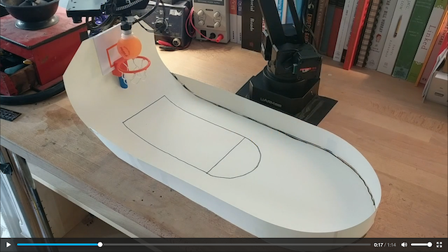

# Basketball

An example project, using the uArm to play a lonely game of basketball.

It uses an attached OpenMV camera to detect the ball, pick it up, then juke around the court for a few seconds, before then dunking on the hoop (awesome!).

See the video, click the image below:

